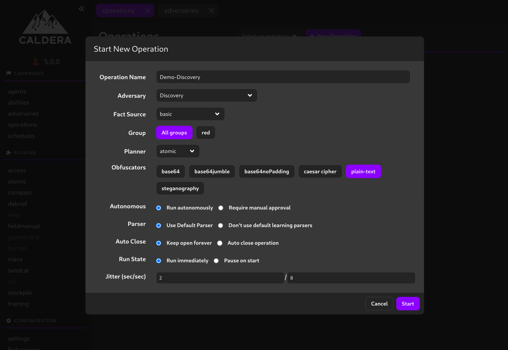

# Detection Engineering Workbench 🛡️
[]()
[]()
[]()
[]()

### ✨ Key Features
- 🔄 Automated deployment of full testing environment
- 🎯 Pre-configured Splunk instance
- 🛡️ Integrated Caldera for attack simulation
- 🖥️ Multiple workstation targets
- 📊 Real-time log analysis
- 🧪 Use case validation framework

## 🚀 Quick Start
```shell
sed -i "s/<local machine's IP>/YOUR LOCAL IP HERE!!!/g" scripts/win_post_install/install.bat && chmod +x ./scripts/build_caldera.sh && ./scripts/build_caldera.sh && docker compose up
```
## Overview: How to use - high level
### 1. Launch campaign/attack via caldera
### 2. Investigate attack in Splunk
### 3. Build/Validate use case to detect attack

## Overview: What is this?
This is a repo for a splunk detection engineering workbench that will enable an engineer to have a portable and quick way to build and validate use cases. On start, it will deploy and fully configure a Splunk instance, a Caldera instance, and a handful of workstations. All of the workstations will be sending logs to splunk on start, and all of the workstations will have a caldera agent installed. All that is needed is a few configurations to be set prior to starting the stack.

# 🛠️ Prerequisites

## Hardware
The Splunk and Caldera instances will not need much CPU/RAM, but the workstations, by default, will allocate 2 cores and 4GB of RAM per workstation. They will also each put a 60GB virtual disk in their respective folders.
- 6 Cores
- 8GB RAM + 4GB per *additional* workstation you add
- 120GB storage + 60GB per *additional* **WINDOWS** workstation you add (linux hosts will use much less)

## Windows
- TBD
## Linux
### Ubuntu
```shell
# Add Docker's official GPG key:
sudo apt-get update
sudo apt-get install ca-certificates curl
sudo install -m 0755 -d /etc/apt/keyrings
sudo curl -fsSL https://download.docker.com/linux/ubuntu/gpg -o /etc/apt/keyrings/docker.asc
sudo chmod a+r /etc/apt/keyrings/docker.asc
```
```shell
# Add the repository to Apt sources:
echo \
  "deb [arch=$(dpkg --print-architecture) signed-by=/etc/apt/keyrings/docker.asc] https://download.docker.com/linux/ubuntu \
  $(. /etc/os-release && echo "${UBUNTU_CODENAME:-$VERSION_CODENAME}") stable" | \
  sudo tee /etc/apt/sources.list.d/docker.list > /dev/null
sudo apt-get update
```
```shell
# Install Docker Engine and a few plugins
sudo apt-get install docker-ce docker-ce-cli containerd.io docker-buildx-plugin docker-compose-plugin && sudo usermod -aG docker $USER
```
### Fedora
- Docker & Docker Compose
    - `sudo dnf install docker docker-compose && sudo usermod -aG docker $USER`

# 🔧 Setup
## Windows
- TBD
## Linux
- Clone repo to current directory
```shell
# Clone repo and cd into it
git clone https://github.com/cayubweeums-repos/detection_eng_workbench.git && cd detection_eng_workbench
```
```shell
# Add the local machines IP address to the install scripts
sed -i "s/<local machine's IP>/YOUR LOCAL IP HERE!!!/g" scripts/win_post_install/install.bat
```
- Fresh build of Caldera and first stack startup
    - You can also run this detached with `docker compose up -d` but for a first time start up it is recommended not to so you can more easily observe any issues
    - **NOTE:** Total start time from fresh clone: 10-15 minutes depending on hardware and internet speed
        - I run an 8840u, 6650 XT, 32GB RAM, and 1000Mbps down on my internet and thats where the guesstimates come from
```shell
# Build Caldera and start stack
chmod +x ./scripts/build_caldera.sh && ./scripts/build_caldera.sh && docker compose up
```

# 🎮 Usage
#### Start/Stop anytime after first build
```shell
# Must be run in the detection_eng_workbench directory
docker compose up -d # Start
docker compose down # Stop
```

#### Launch an 'Operation' via Caldera
- Log in to Caldera UI at `http://localhost:8888`
- Go to `Operations` > `+ New Operation` > Name the operation and pick your adversary to emulate > `Start`
    - 
    *Figure 1: For the demo I used the `Discovery` adversary profile*
- This will redirect you to a page showing the progress of the operation through its various abilities. You can see the output of these various attacks at the `View Output` button

#### Share files with the Windows workstations
Open 'File Explorer' and click on the 'Network' section, you will see a computer called host.lan. Double-click it and it will show a folder called Data, which is bound to the `workstation_share` folder in the repo. Put anything you want to pass to the workstations in this folder.

> [!TIP]
> You can map this path to a drive letter in Windows, for easier access.


### 💻 Component Access
| Component | URL | Default Credentials |
|-----------|-----|-------------------|
| Splunk UI | `http://localhost:8000` | `admin/password` |
| Caldera UI | `http://localhost:8888` | `admin/admin` |
| Win Workstation 1 | `http://localhost:8006` | `user1/password1` |
| Win Workstation 2 | `http://localhost:8007` | `user2/password2` |

**NOTE**: All passwords are insecure and not intended for production use. If you would like to change any credentials, reference the `compose.yml` file. These will still be plane text, so for more advance uses of this stack, you should use secrets in github or some other secret manager.

### Improvements
- Improve logging via:
  - Enabling script block logging
  - Process Creation Auditing
  - Command Line Process Auditing
  - Auditing Directory Service Changes
  - File Auditing
